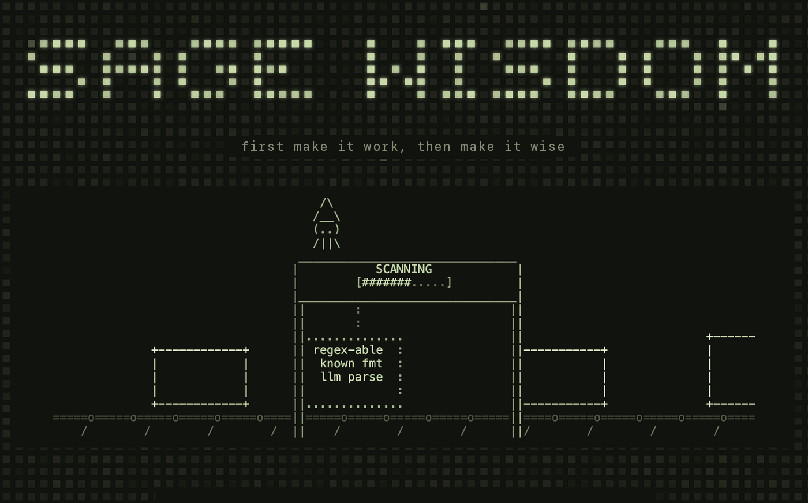

# Sage Wisdom



**[sagewisdom.bot](https://sagewisdom.bot)** — a skill for your coding agent.
It finds where a fast decision model makes your AI product faster, cheaper,
safer or better — and **tests each swap with an eval before shipping it**.
It can also invent new features that a 200 ms judgment makes possible.

> First make it work. Then make it wise. An LLM gets the feature working.
> Sage turns the judgment inside it into a fast, typed, calibrated decision.

## Use it

Paste this into a Claude Code or Codex session in your project folder:

```
Read https://sagewisdom.bot/SKILL.md and follow the steps to audit this repo's ai pipeline.
```

Or install it as a local skill: copy this directory into your skills folder
(e.g. `.claude/skills/sage-wisdom/`).

The audit and plain-code fixes need no API key. Proving a Sage fix does —
the eval runs against [Levanto Sage](https://docs.levanto.ai) (`SAGE_API_KEY`
env var, billed per token, plans from $14/mo at
[platform.levanto.ai](https://platform.levanto.ai)).

## What is Sage?


[Levanto Sage](https://docs.levanto.ai) is a decision model. You give it
content (text or an image), a question, and the possible answers — yes/no,
labels, a pick, a score, a ranking. It answers in a few hundred ms with a
calibrated probability, thinks first on hard questions, and says `null`
when it isn't sure. It can't write text, so untrusted input can't make it
say anything — though it can still try to sway which answer it picks.

The skill checks every model call in your repo: should it exist, should it
be plain code, is it a decision Sage can take — and backs each answer with
an eval.

## What's inside

- `SKILL.md` — the skill: `assess` and `invent` modes, scan → prove → ship
  with the user deciding at each step, a Sage cheat sheet, and a gallery of
  16 recipes (gates, triage, routing, agent supervision, images, games…),
  written with [Levanto](https://levanto.ai)
- `index.html` + assets — the [sagewisdom.bot](https://sagewisdom.bot) site
  (static, deploys on Vercel; serves `SKILL.md` alongside the page)
- `scripts/sage-intro.sh` — the animated intro above. Human-only eye candy:
  it needs a real TTY, so agents can't run it — run it yourself in a plain
  terminal
